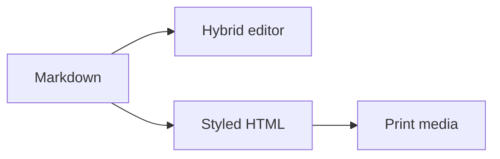

[toc]

# Output Benchmark

> [!TIP]
> One canonical source powers every surface.

Inline math $a^2 + b^2 = c^2$ is paired with a footnote[^pipeline].

## Delivery matrix

| Surface       | Status |
| ------------- | ------ |
| Hybrid editor | Ready  |
| Styled HTML   | Ready  |
| Print media   | Ready  |

- [x] Preserve canonical Markdown
- [x] Render derived output safely

$$
\int_0^1 x^2\,dx = \frac{1}{3}
$$

[^pipeline]: The source remains byte-for-byte unchanged.
